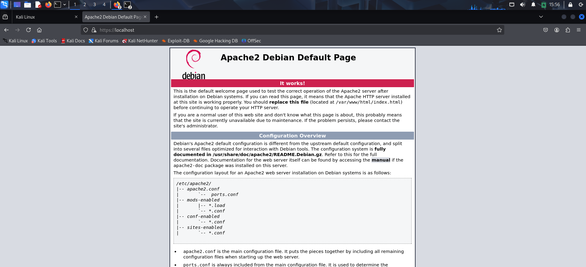

# 🔒 TLS Setup on Kali Linux with Apache

This project demonstrates how to set up a secure HTTPS server using a self-signed TLS certificate on Kali Linux, using Apache2. It is part of my cybersecurity portfolio to showcase hands-on knowledge of configuring web servers securely.

---

## 🛠️ Tools & Environment

- **OS**: Kali Linux (Debian-based)
- **Web Server**: Apache 2.4+
- **TLS/SSL**: OpenSSL (self-signed certificate)
- **Browser**: Firefox/Chromium for testing `https://localhost`

---

## 📌 Objective

To set up HTTPS on a local Apache server using self-signed TLS certificates, and configure Apache to serve content securely over port 443.

---

## 🧰 Steps Followed

1. **Install Apache and OpenSSL**:
   ```bash
   sudo apt update
   sudo apt install apache2 openssl -y


## 📸 Screenshots

### 1. Apache Service Status
Shows that the Apache2 service is running successfully.


---

### 2. TLS Verified with curl
Output of `curl -k https://localhost` confirming TLS is active and serving HTTPS content.


---

### 3. HTTPS in Browser
Browser showing the padlock and HTTPS connection working correctly.


